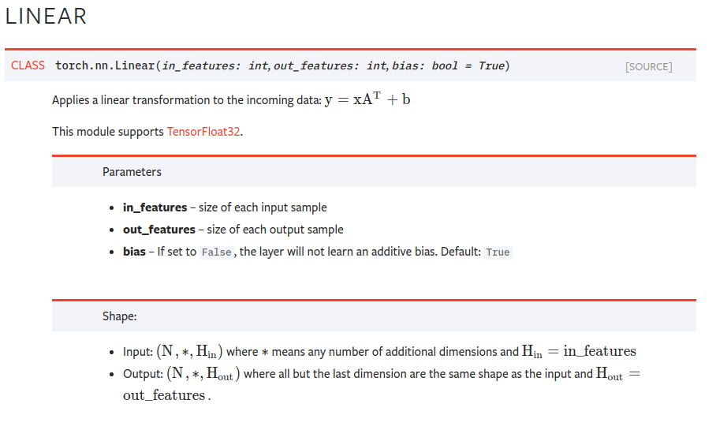
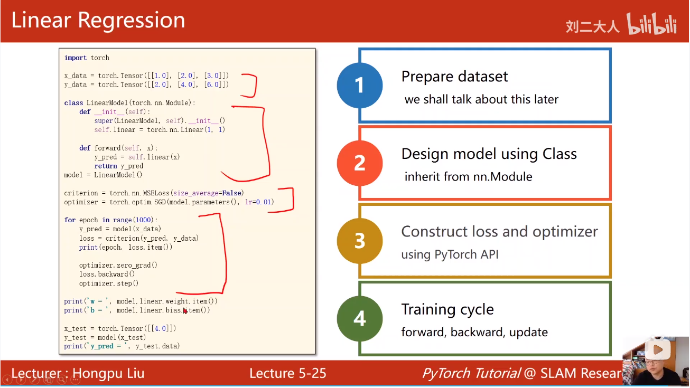

[TOC]

# learning pytorch in pycharm

20201101

14:https://www.bilibili.com/video/BV15K411N7CF?p=14


20201106

## 使用pytorch的四个步骤

### 准备数据

### 设计模型【使用Module类】

```python
# 继承Moudle类，Module自动实现backward步骤
class LinearModule(nn.Module):
    # 这里必须实现这两个方法
    def __init__(self):# 初始化对象
        # super这步必须要有
        super(LinearModule, self).__init__()
        # 构造了一个Linear对象，包含weight和bias这两个Tensor
        self.linear = nn.Linear(1, 1)

    def forward(self, x):# 前向反馈
		# 这里实际是nn.Linear实现了__call__()方法，达到类的调用
        y_pred = self.linear(x)
        return y_pred

# model是callable的，可以直接model(x),类似linear(x)
model = LinearModule()

```

可以查看Linear api。




### 构造loss和optimal【使用 pytorch api】

### 迭代训练【forward、backward、update】


### 总结



