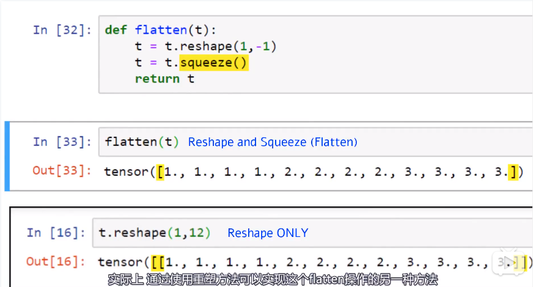

[TOC]

## tensor 张量

一个相比于`标量`,`向量`,`矩阵`更通用的数据结构。


### 属性：秩、轴、形状


秩：张量的维数n，Rank of a Tensor.表示需要n个来索引一个特定的数据。

~~~python
a = [1,2,3]
a[2]

b = [[1,2,3],
    [1,2,3],
    [1,2,3]]
b[1][2]
~~~


轴：Tensor的一个特定轴数，几个维度就是几个轴。比如X轴，Y轴


```python
b = [[1,2,3],
    [1,2,3],
    [1,2,3]]

# axis1
b[0]
b[1]
b[2]

# axis2
b[0][0]
b[0][1]
b[0][2]

b[1][...]
b[2][...]

```


形状（shape）：指的是Tensor的size


## Class: torch.Tensor

```python
t = torch.Tensor()
type(t)


# 数据类型
print(t.dtype)
# 设备，数据被分配的位置
print(t.device)
# 布局
print(t.layout)
```


创建设备.使用多设备时，张量之间的张量操作必须存在于同一设备上，且数据类型要一样。

```python
device = torch.device('cuda:0')
```

 

### 创建Tensor

1. 有数据时创建

~~~python
data = np.array([1,2,3])
type(data)

# 使用类构造函数创建
torch.Tensor(data)

# 使用工厂函数，返回对象。好处是允许动态对象创建,参数更多
torch.tensor(data)

# 工厂函数	接受任何数组结构的数据
torch.as_tensor(data)

# 工厂函数	只接受numpy数组
torch.from_numpy(data)
~~~

​	torch.Tensor()的默认dtype: 	torch.float32

```python
torch.get_default_dtype()
```

​	前两种创建tensor时，使用data副本，重新copy一份；后两种创建tensor时，直接映射原数组，所以原数组改变时，后两种的tensor也发生改变，而前两种不会。

​	常使用torch.tensor()和torch.as_tensor()来创建pytorch数组

前一种参数更多，后一种内存共享


2. 无数据时创建

```python
# 单位张量
torch.eye(2)
# 全0张量
torch.zeros(2,2)
# 全1张量
torch.ones(2,2)
# 随机张量
torca.ransd(2,2)
```


## 基本张量操作

### 重塑操作	reshaping operations

```python
# 属性：形状；就是size
t.shape

len（t.shape）

# 张量的标量分量
torch.tensor(t.shape).pord()

# return:
# 	tensor(12)


# 元素个数
t.numel()

```

#### reshape和faltten

 ```python
# 重塑	轴的数量不变，所有数据放在第一个轴
t.reshape()

t.flatten(start_dim=1)

# t.flatten()	重塑并压缩成一维数组
t.reshape()
t.sequeeze()	#压缩所有的轴

# 拼接
t.cat((t1,t2),dim=0)
# 以堆栈方式拼接张量	产生一个新的轴
t.stack((t1,t2,t3))
 ```




### 元素操作	element-wise operations

- 使用标量值的运算

- 张量广播

  定义在操作过程中如何处理不同形状的张量

  复制张量的一个或多个轴，使它和另一个张量的形状相同

  ```python
  t1 = torch.tensor([[1,2],[3,4]],dtype=torch.float32)
  
  np.broadcast_to(2,t1.shape)
  # array[[2,2],[2,2]]
  
  t1 + 2
  # 等价于
  t1 + torch.tensor(np.broadcast_to(2,t1.shape),dtype=torch.float32)
  ```

  ```python
  np.broadcast_to(t2.numpy(),t1.shape)
  ```

- 减缩操作   argmax函数

  减少张量中包含元素数量的操作

  ```python
  t = torch.tensor([[1,2,3],[1,2,3],[1,1,1]],dtype=torch.float32)
  
  # 元素标量求和
  t.sum()
  
  t.prod()
  
  t.mean()
  
  t.std()
  
  # (未指定轴)
  # 张量中元素最大值
  t.max()
  
  # 元素最大值在fltten操作后的索引
  t.argmax() 
  
  # 指定轴的操作
  t.max(dim=0)	#返回最大值张量和最大值索引张量
  t.argmax(dim=0)		   
  ```

  argmax函数

  

### 还原	reduction operations


### 访问操作	access operations

