[TOC]

### CNN基础篇

## 基本结构

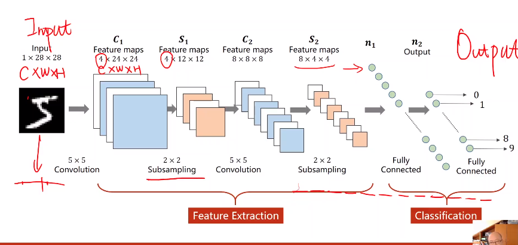


## 卷积过程

向两个维度进行卷积


### 单通道

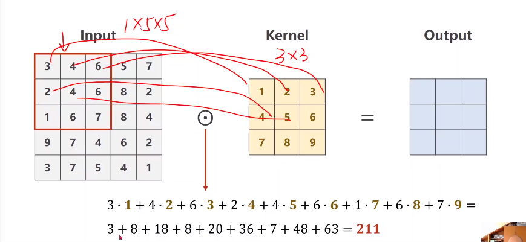


### 三（多）通道

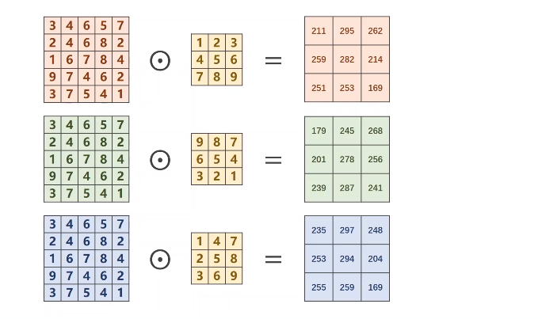

一个通道需要一个kernel

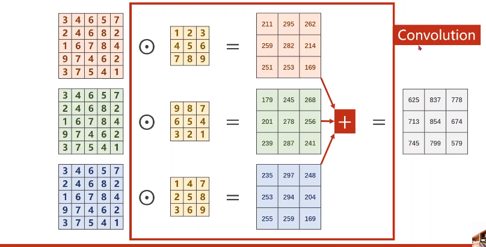

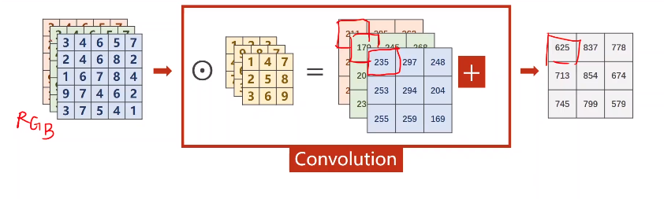

画图：

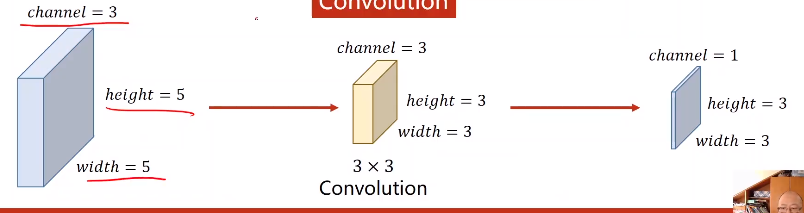


- 多个输出通道（**即改变输出通道**）

  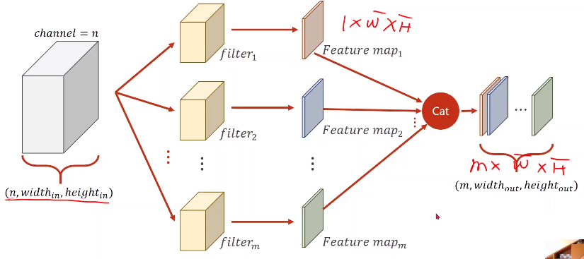

卷积核的数量为输出通道的通道数

每个卷积核的数量为输入通道的通道数

## 代码demo

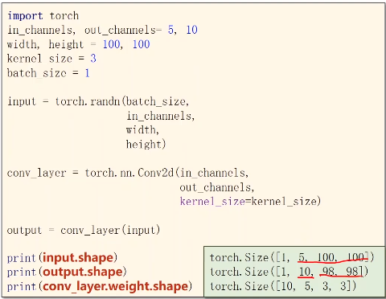


## Conv2d常用参数

padding：填充外边距，一般用H,W整除2

bais：

stride：步长，每次卷积滑动的大小

#### 对应代码

```python
self.conv1 = nn.Conv2d(in_channels=in_channel,#输入通道数，即输入数据的通道数
                       out_channels=10,#输出通道数，即输出数据的通道数
                       kernel_size=kernel_size,#卷积核大小，一般是int，也可tuple，如3【表示3x3】；（5，4）【表示5x4】
                       stride=1,#卷积移动的步长
                       padding=padding)# 是否用0填充数据四周
print(self.conv1.weight.shape)

# 以此可以确定设置的卷积的shape:[out_channels,in_channels,kernel_size,kernel_size]
```


## 最大池化层 max pooling

没有权重，不需要单独做一层，反之单独成层。通道数不会改变，会**改变宽高**

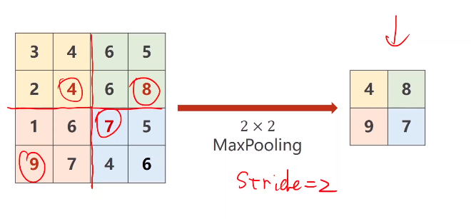

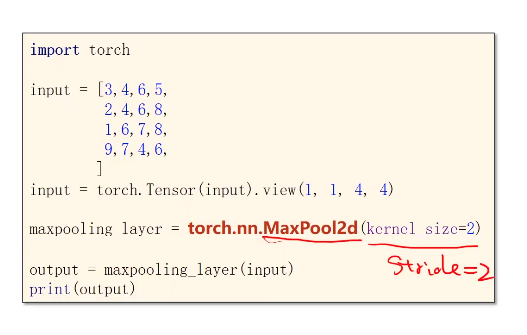

## 手写数字识别模型

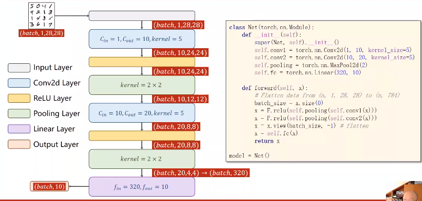

x.size(0),这里，对应那个n，即第一个

