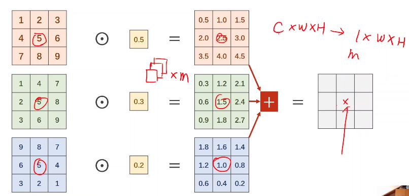

[TOC]

# CNN高级篇

## GoogleNet

### 减少代码冗余------>函数、类

将相同的部分定义为一个模块再调用

函数、类===============定义Inception

### 信息融合

最终信息包含了各类源信息

注意x的来源，x来自卷积后的2.5，1.5，1.0，又来自最初的3个5。

**即融合了不同通道的信息。**

### 1X1conv[降低运算量]

降低运算量

### Concatenate：沿通道方向拼接

nn：带有训练权重

F：不带训练权重

沿第一个维度（维度顺序：bcwh），即Channel维度

### Inception模块[自定义层（模块）]

### Module实现

1408经过网络这层的输出，去掉**全连接**的那三行代码，实例化输出一次得到他的次数。

## ResidualNet（ResNet）

### 梯度消失

反向传播，链式求导，假设乘以一个小于1的数，最后趋近于0，那么梯度下降时，几乎不会下降。

解决：每层加锁，不适用深度学习，层数太多

跳连接

### module

逐步观测，注释后面的代码，查看张量大小是否是预期结果。

