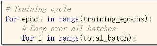
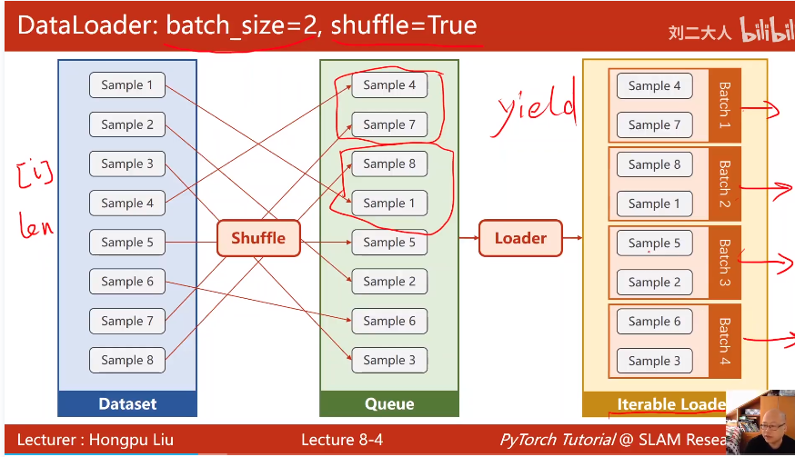

[TOC]


# 数据加载


## 加载方式

- batch

  将所有样本一次性载入进行计算。计算速度快，性能不如下面的好

- 单个样本

  在随机梯度下降中使用，只用一个样本。有较好随机性，克服鞍点，训练时间非常长，性能好

- mini-batch

  上面两者的折中

### mini-batch




#### epoch

所有样本进行了一次训练（FP和BP、update）


#### batch-size

一次训练（FP、BP、update）时所用的样本数量


#### iteration

batch分了多少个

iteration = total example / batch-size


## DataLoader



### 参数

batch_size=2	

shuffle=True	随机打乱样本顺序


### 数据集要求

支持索引、长度


## 代码实现

```python
import torch
from torch.utils.data import Dataset
from torch.utils.data import DataLoader


class DiabetesDataset(Dataset):
    def __init__(self):
        """
        load data;two ways:
        1: all data
        2: batch
        """
        pass

    def __getitem__(self, index):
        """
        a implement of data index
        :param index:
        :return:
        """
        pass

    def __len__(self):
        """
        a implement of get length of dataset
        :return:
        """
        pass


dataset = DiabetesDataset()

train_loader = DataLoader(dataset=dataset,
                          batch_size=32,
                          shuffle=True, # 随机打乱数据读取
                          num_workers=2) # 多线程数目读取数据
for epoch in range(100):
	for i,data in enumerate(train_loader,0):
        pass
```


在windows下会报错，多进程的实现在不同系统的实现不一样。linux使用fork，windows使用spawn，windows代码报RuntimeError，解决办法：

封装代码：

```python
if if __name__ == '__main__':
    for epoch in range(100):
        for i, data in enumerate(train_loader, 0):
            pass
```

