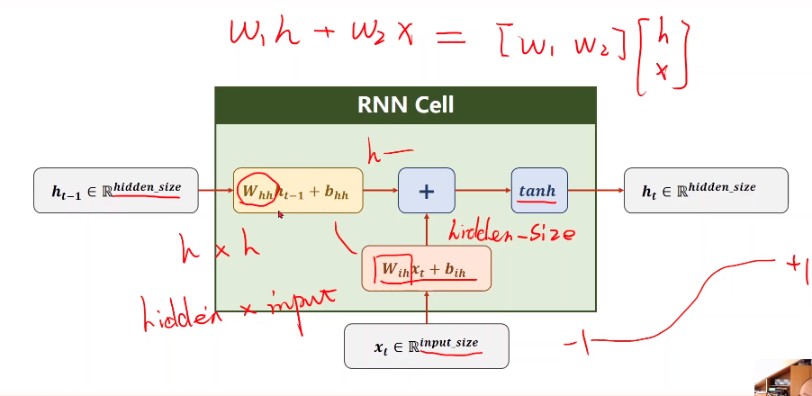
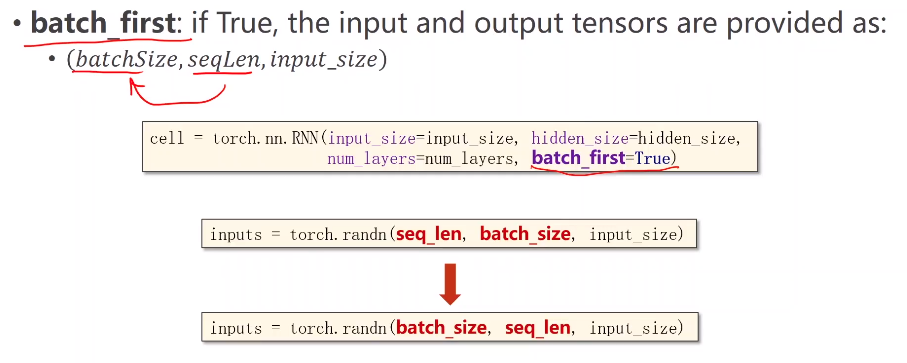

[TOC]

# 基础RNN

## 总述

dense/deep 	稠密网络  ====  FC  全连接

 用来处理带有序列模式的数据、先后时间序列、数据共享概念、权重共享机制

==序列、numLayers==

## 下雨例子

x1，2，3表示三天数据，每个x包含温度、气压、是否有雨三个特征，拼接后作为输入数据

## RNN Cell

RNN Cell 本质：线性层，维度映射，改变维度。区别就是

RNN Cell就是一个线性层

==把3维度映射为5维度==

红色箭头的输入就是上一个输出的h，h被称为隐层

h0表示先验，可以初始化为0，或者使用CNN+FC转为将图像转为多维

这些绿色的格子（RNN Cell），其实是一个格子。即右边图示是左边图示的解释。

下面图是代码实现：使用一个循环解决，不同的是x和h的值。

### RNN Cell内部结构图示

input_size：输入X的维度

hidden_size: 隐层维度

### 过程

自定义RNN Cell，需要参数：输入维度，隐层维度

维度要求

​			经过x~1~和h~0~得到隐层h~1~

​	

各变量具体含义：	

### demo

参数、初始化

设置序列数据

隐层全0，batch_size和hidden_size

循环遍历dataset

hidden=上一级的input和hidden

## RNN

把多个RNN Cell连接循环算出隐层，并且可能有多层（横向）的就是RNN。

### 维度要求

numLayer：初始隐层的层数。这里是3层。一种颜色表示一个线性层

下对角是input

**主要是多了numLayers**，xxSize是表示相应维度

### demo

设置参数

初始化RNN

设置input和hidden

直接调用cell，不用写循环

### 其他参数

batch_first：

 

