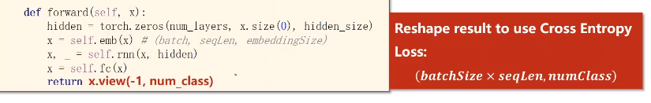
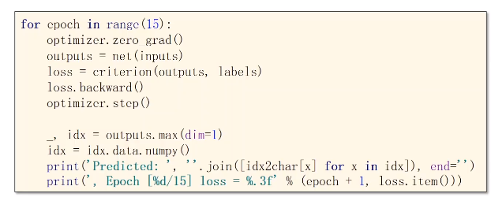

[TOC]

# RNN实现hello--ohlol

## 准备数据

### 构造字典

有多少个不同的词，词向量就有多少长，每个词向量只有一个1，其余是0，称为独热向量。

在这里是一个词有4个不同的字母，故向量长4.

独热向量的每行就是x1，x2，x3，x4，x5，输入维度input_size就是4

## 设计模型

### 结构

【接交叉熵，产生一个分布，分类问题】

是为了判断输出属于helo四个字母的那个字母

输入x为独热向量，结合h，输入RNN Cell

再接入softmax得到各字母的预测概率

再通过y的独热向量，计算NLLLoss

得到最后loss

CrossEntropyLoss：交叉熵损失

## 实现

### 参数

### 数据

索引转独热向量

-1：表示自动处理

### model

batch_size只有在构造h0时才需要

### loss、optimizer

交叉熵

### train

**注意loss：**是个计算图，所以不用`.item()`

维度：

预测：

四维的h，找最大的那个字母

### result

## RNN训练方式

## model优化

### RNN方式

两维好处：使用交叉熵时变成了矩阵

输出：

### 结果

## 独热向量（one-hot）

缺点：

- 纬度高，多少种就是多少维。【high-dimension】
- 向量过于稀疏。【sparse】
- 硬编码，不是学习出来的。【hardcoded】

## 嵌入层（embedding）

EMBEDDING：把一个高维的稀疏的样本映射到低维的稠密的空间里【即降维】

特点：

- low-dimension
- dense
- learned from data

### 示例【4 --》 5】

​			输入索引2：转置、使用矩阵乘法索引

4行5列做转置，然后与【0 0 1 0】的转置相乘，得到索引2的那行

### 用法

线性层是为了保证输出的隐层（h）的维数和预测的分类数一致

x必须是长整形张量

### 参数

num_embeddings:input的独热向量维数（embedding的高度）

embedding_dim:embedding的宽度

### 代码

注意点：

## LSTM

## GRU

RNN 和 LSTM 的折中，LSTM时间复杂度高，学习能力强。

