[TOC]

# 循环网络分类器：名字分类（名字对应国家）

## model

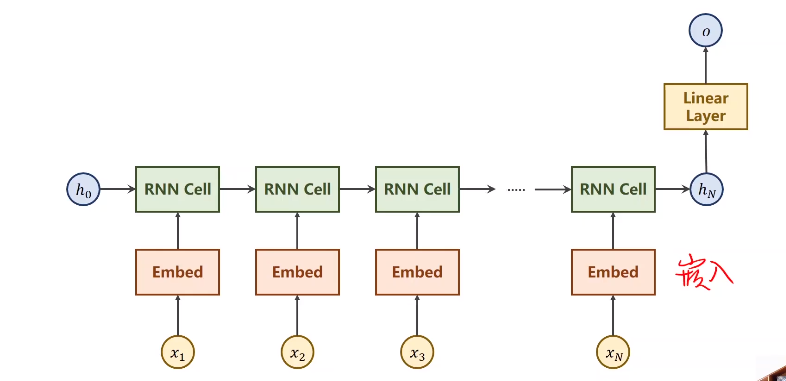

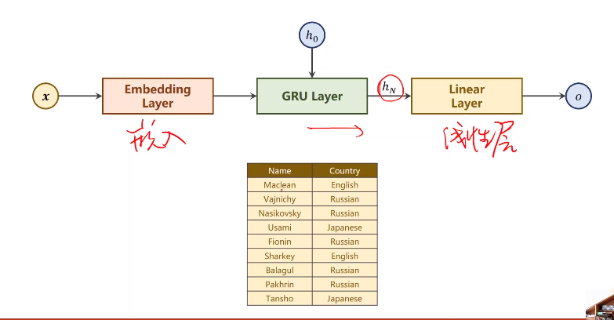

## 主要循环

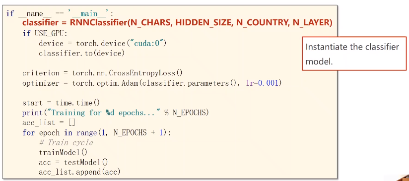

N_CHARS:字符数量。英文字符转成独热向量

HIDDEN_SIZE:隐层维度，GRU输出的h的维度

N_COUNTRY:国家数目，即分类器数目

N_LAYER:GRU层数

start：训练时间

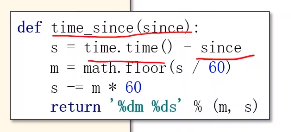

## 准备数据

字符集，使用ASCII码

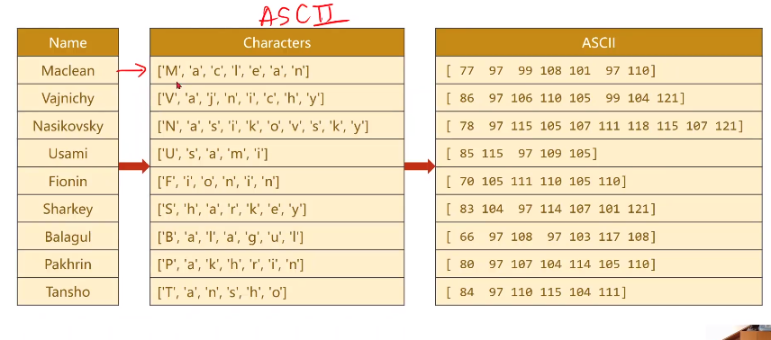

用0填充长度，每个数字都是一个向量，构成一个张量

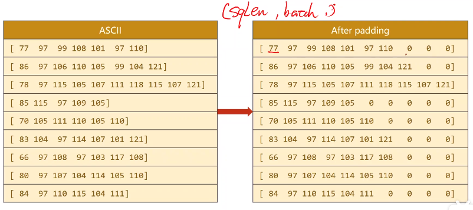

y：

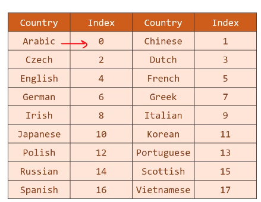

### 数据集构造

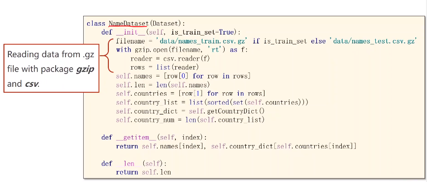

getitem：name字符串，country是索引

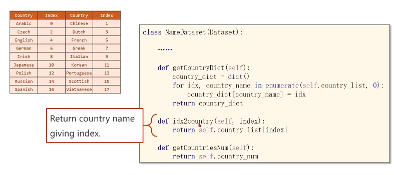

### 数据加载

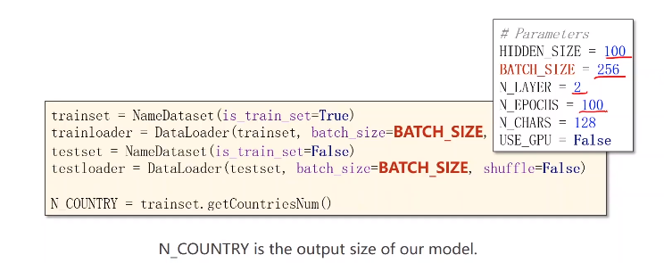

## model design

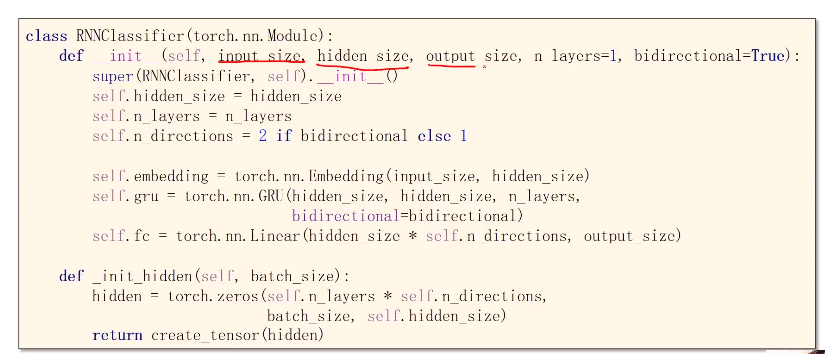

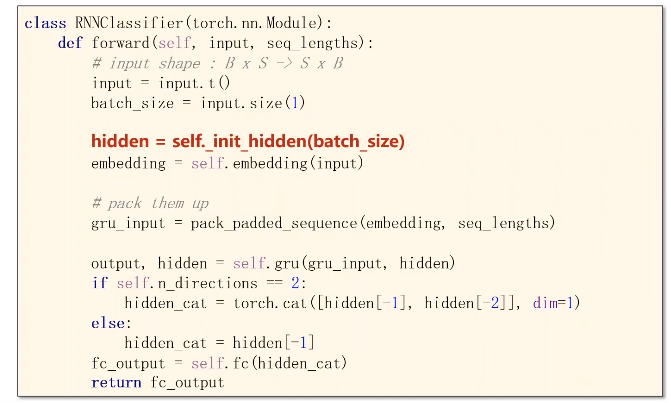

**embedding过程：**

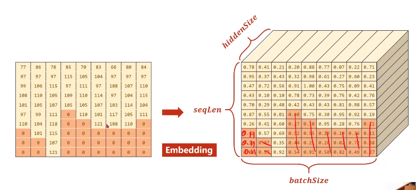

input_size:

hidden_size:

output_size:

n_layers:

bidirectional:双向还是单项循环网络

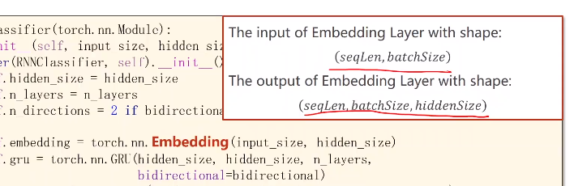

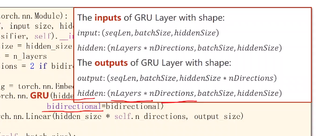

pack up：要求排序

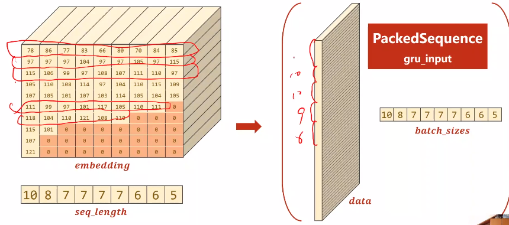

**双向循环网路**

正向和反向得到的隐层做拼接

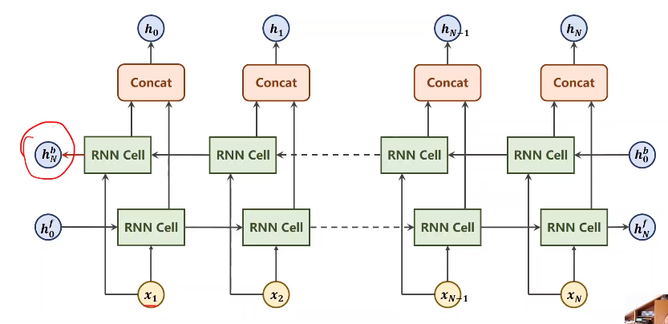

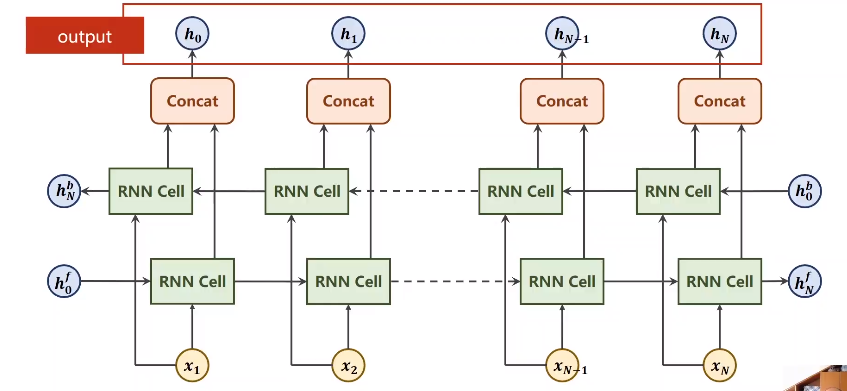

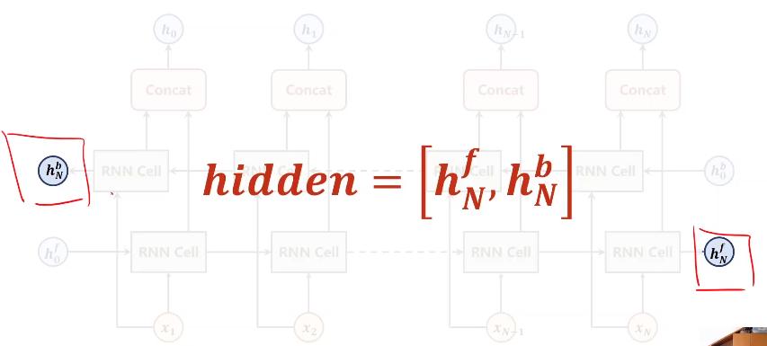

## name to tensor

字符、ASCII码数字、填充、转置、排序

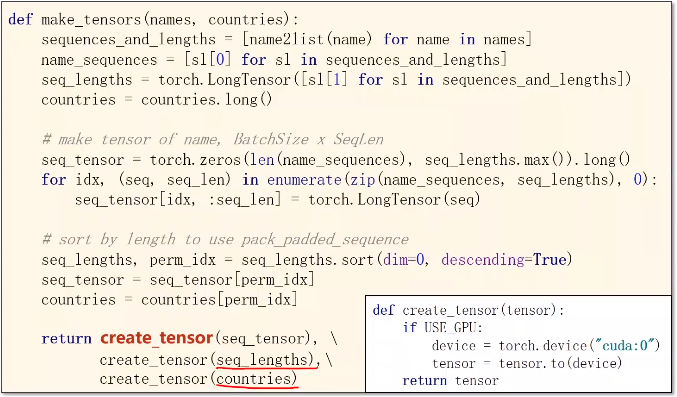

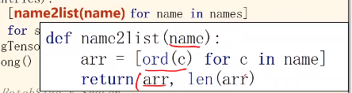

## train

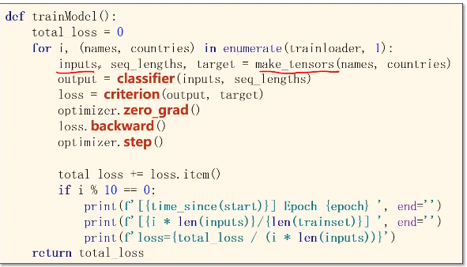

## test

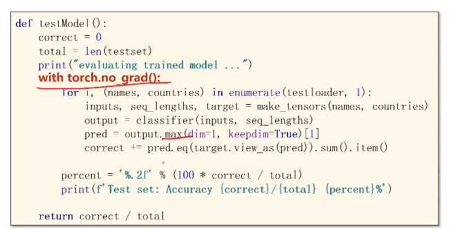

## 作业

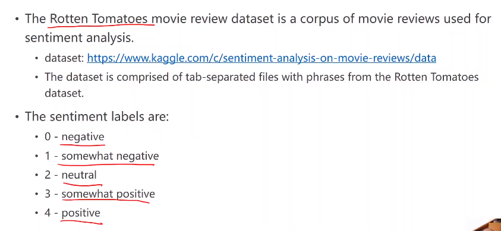

# 总结

解决的是带有序列关系的数据