[TOC]

@[TOC]

# 手写数字识别

## 通道channel

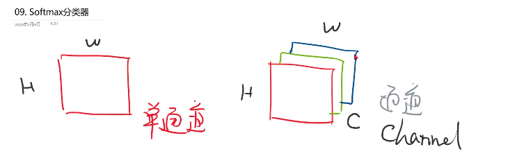

单通道

三通道：rgb（红绿蓝）

## PIL-->pytorch 变换

WxHxC   ===> CxWxH(pytorch中)

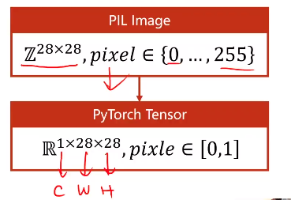

## transform

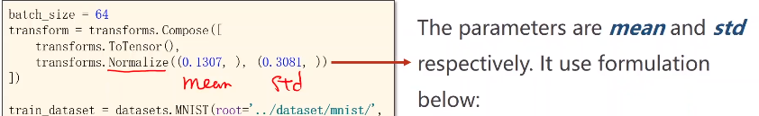

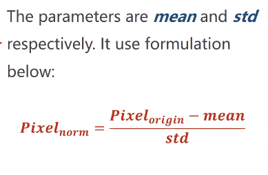

先转为tensor，再归一化，两个参数是均值和标准差

## 模型

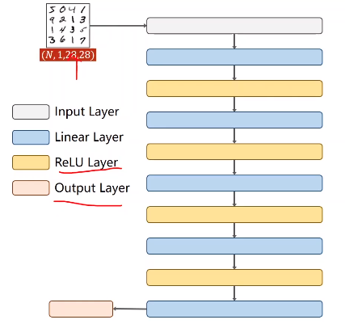

把每个图像转成向量，得到矩阵N x 1\*28\*28

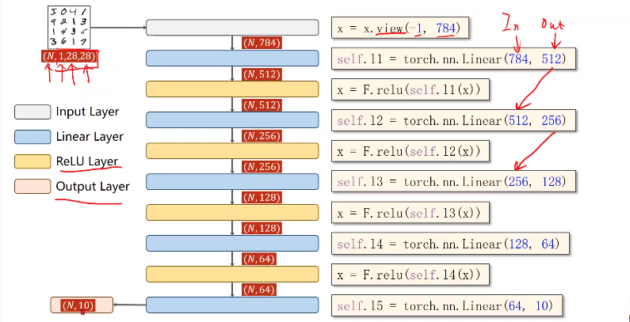

## 代码实现

### prepare dataset

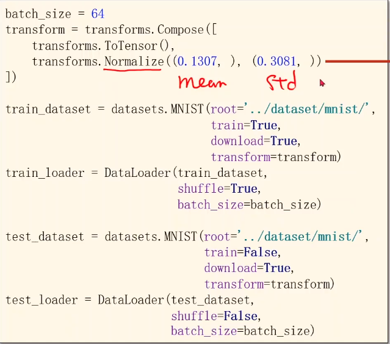

### loss  optimal

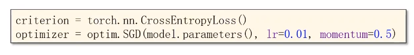

momentum 冲量

### train

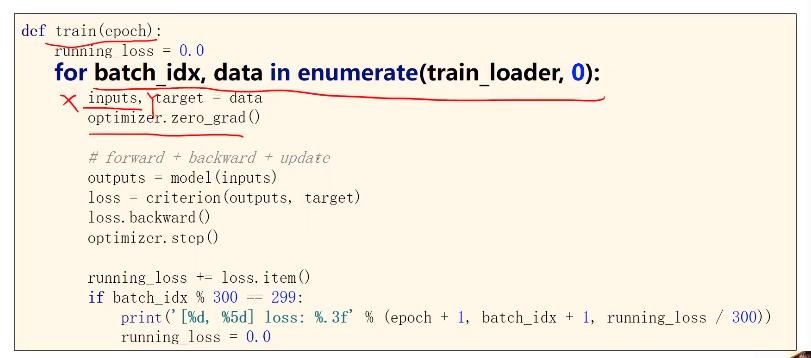

### test

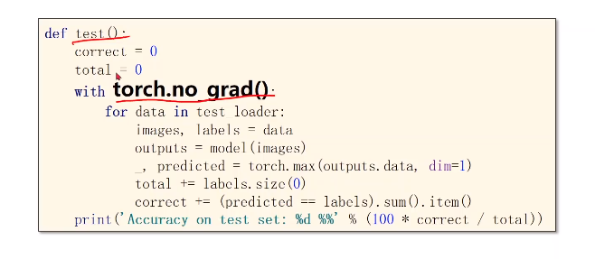

不做梯度计算

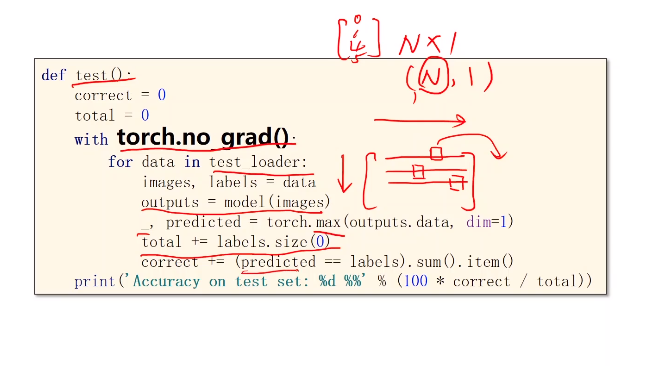

最大值下标，行是维度0，列是维度1

注意   `-，`

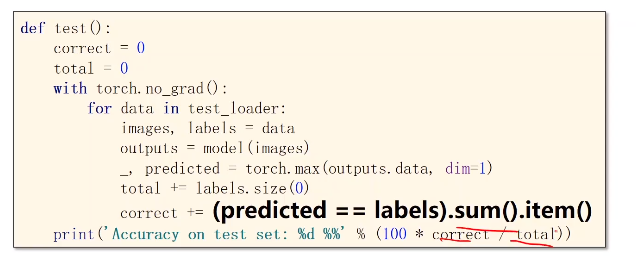

### run

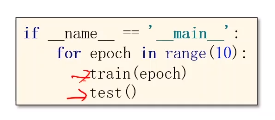

一轮训练一轮测试

### 结果

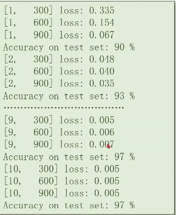

## 总结

全连接

局部信息利用不好

使用的是原始特征

可以自动提取特征，比如CNN

## 练习

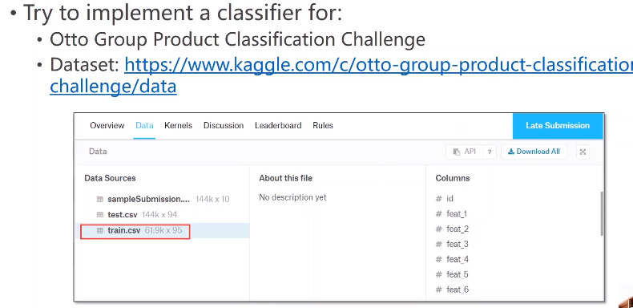

